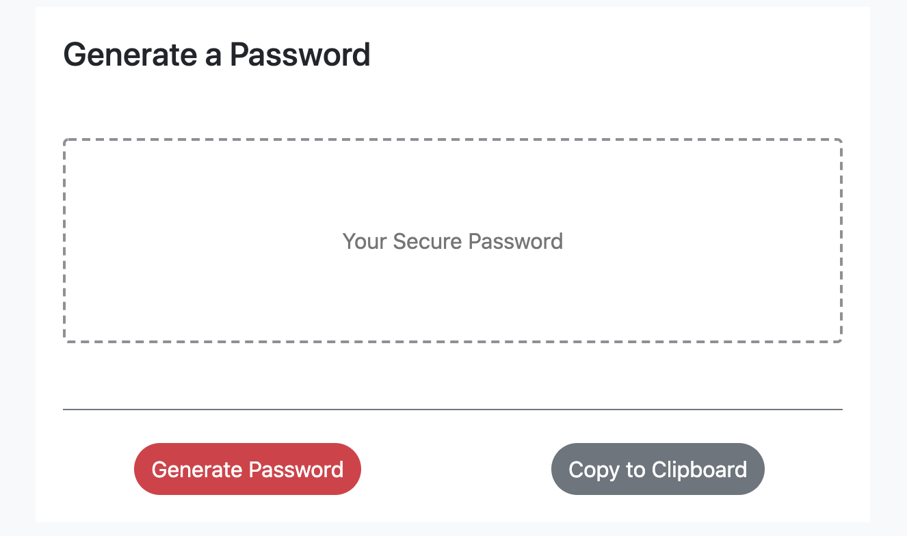

# Password-Generator

In order for the user to generate a random password, they must select from the input requests of:
    -length of password
    -special characters and,
    -numeric characters

Knowing that the user will need a password generated with alphabet characters - this input will be default to both upper and lower case letters.

In this case, the user is ensured that at least one character is selected without them actually having to 'select' an input. 

# Criteria

When the user clicks on 'Generate Password', the user will be prompted to select on password criterias.
Once the user clicks on submit, they can then 'copy to clipboard' the password and use the PW of their choosing.

# Installation 

1. Open the GitHub Repo to the Password Generator link
2. Click on Password Generator
3. Select from characters and length and click submit, or exit out the modal through the 'x' button
4. Copy to Clipboard
5. Generate a new password at your pleasing as needed.

